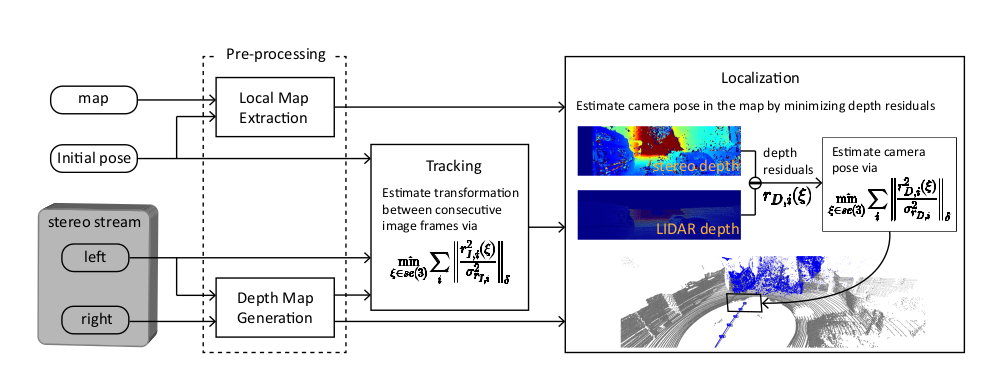
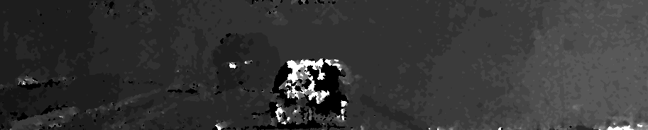
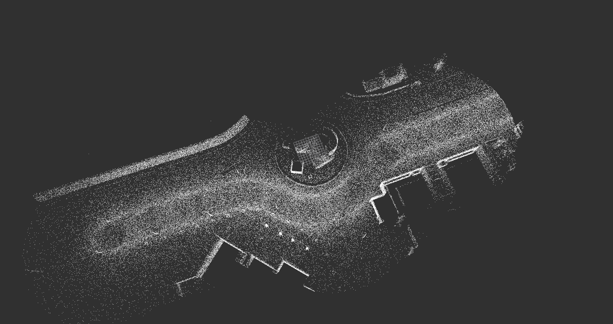
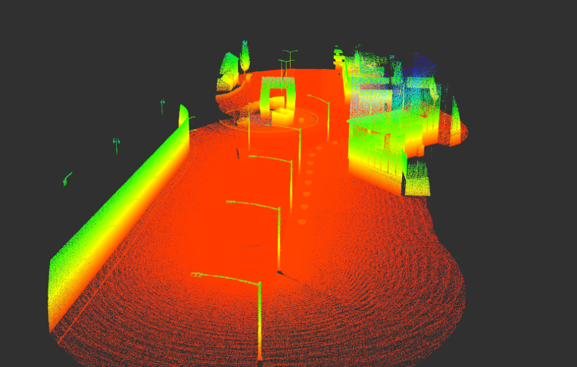
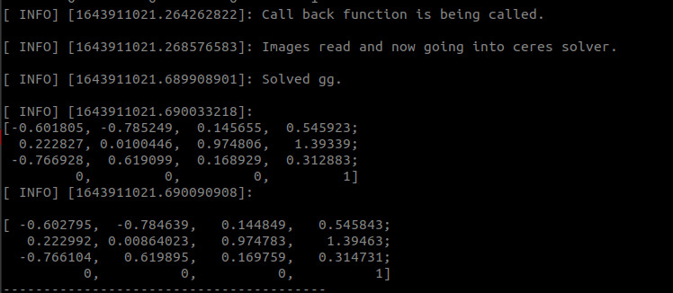

# Stereo-LIME
## Stereo Camera assisted Localization in Mapped Environment

# Prerequisites
### **Ceres Solver**
Follow [Ceres Installation](http://ceres-solver.org/installation.html)

Install [OpenCV](https://gist.github.com/Mahedi-61/804a663b449e4cdb31b5fea96bb9d561) and [PCL](https://pcl.readthedocs.io/projects/tutorials/en/master/) from source.

## Depth Map Generation

The left and the right image from the stereo camera is used to compute the disparity map. From disparity map, we obtain the depth of a point using the formula:

`disparity = x - x' = (B*f)/Z`

Here, B is baseline, i.e, distance between the left and right camera & f is the focal length of the camera. Z is the depth of that pixel value.

Example, `depth image`:

## Local Map Generation

The local map is generated via `pcl::octree::OctreePointCloudSearch`, which searches for neighbours within a voxel at a given point which in our case is the `initial pose` obtained from [VINS-Fusion](https://github.com/HKUST-Aerial-Robotics/VINS-Fusion).

  
  

## Localization

The final camera pose is obtained by minimizing the depth residual which is the difference between the depth of the map point in local map and the corresponding stereo depth. This non-linear optimization problem is solved by `Ceres-Solver`.

  

